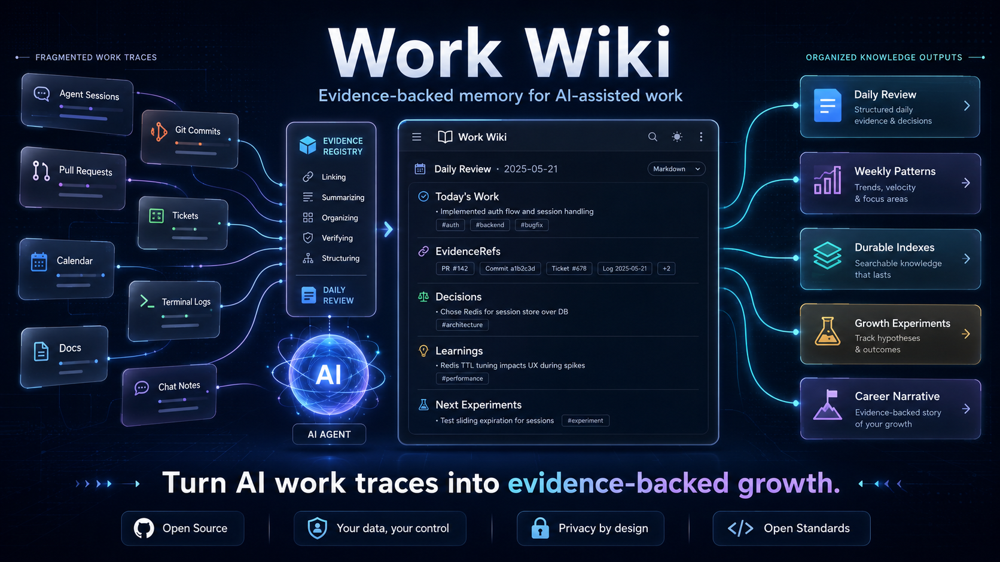

# Work Wiki



<p align="center">
  <strong>Work Wiki: Turn your AI work traces into growth.</strong>
</p>

<p align="center">
  English | <a href="https://github.com/bingshuoguo/work-wiki/tree/zh-CN">中文</a>
</p>

<p align="center">
  A private, Markdown-first system for evidence-backed daily reviews, durable work knowledge, and better agent collaboration.
</p>

Work Wiki helps you turn scattered work signals into a living record of what happened, what changed, what was verified, and what keeps repeating.

It is designed for people who work with agents such as Codex, Claude Code, Gemini, Cursor, Antigravity, Copilot Chat, and similar tools. Instead of asking an agent for a vague end-of-day summary, you give it a structure for reading evidence, writing grounded reviews, maintaining indexes, and turning repeated patterns into improvement experiments.

```text
Evidence sources
  -> Evidence registry
  -> Daily review
  -> Weekly and monthly patterns
  -> Durable indexes
  -> Growth experiments
```

## Why Work Wiki

Modern work does not live in one place. A single task may span an agent session, a Git branch, a pull request, a ticket, a test run, a calendar block, a design doc, and a chat thread.

That makes normal status updates brittle. They rely on memory, miss verification details, and rarely capture the process patterns that explain why work felt smooth or expensive.

Work Wiki gives your agent a review protocol:

- Look for evidence before writing conclusions.
- Separate observed facts from inference.
- Track source coverage and uncertainty.
- Keep reusable decisions, learnings, workflows, and recurring problems out of one-off summaries.
- Use patterns from daily work to improve how you collaborate with agents.

## What You Can Do With It

| Need | Work Wiki gives you |
| --- | --- |
| Daily review | A structured review of tasks, outputs, learning, verification, and evidence gaps. |
| Weekly review | Pattern mining across daily reviews, including recurring problems and growth experiments. |
| Monthly review | A higher-level view of outcomes, skill growth, bottlenecks, and next goals. |
| Evidence tracking | A private `EVIDENCE_SOURCES.md` registry that tells agents where to look next time. |
| Durable knowledge | Long-lived indexes for projects, decisions, learnings, skills, workflows, collaboration, and recurring problems. |
| Better agent habits | Experiments and scorecards for improving prompts, verification, context loading, and review quality. |

## How It Works

Work Wiki is not an app server or hosted service. It is a portable set of Markdown protocols, templates, and workspace conventions.

1. **Discover sources**  
   Start with local evidence such as agent sessions and Git repositories. Add external providers only when explicitly enabled.

2. **Maintain the registry**  
   Store source metadata in private `EVIDENCE_SOURCES.md`. Record registry changes in private `EVIDENCE_SOURCES_CHANGELOG.md`.

3. **Write reviews from evidence**  
   Daily reviews cite lightweight `EvidenceRef` entries instead of copying raw private content.

4. **Promote durable knowledge**  
   Decisions, learnings, workflows, skills, and recurring problems move into `indexes/`.

5. **Close the growth loop**  
   Repeated patterns become experiments, scorecard signals, coaching notes, or quality-of-life adjustments in `growth/`.

## Quickstart

1. Copy `workspace-template/` into a private workspace.
2. Open that workspace with your preferred agent.
3. Copy `EVIDENCE_SOURCES.example.md` to `EVIDENCE_SOURCES.md`.
4. Copy `EVIDENCE_SOURCES_CHANGELOG.example.md` to `EVIDENCE_SOURCES_CHANGELOG.md`.
5. Ask your agent:

   ```text
   Initialize my Work Wiki evidence sources. Use local sources first,
   metadata-only mode, and no external provider scans unless already enabled.
   ```

6. Review the generated `EVIDENCE_SOURCES.md`.
7. Ask for your first review:

   ```text
   Review today's work using Work Wiki.
   ```

8. At the end of the week:

   ```text
   Create this week's Work Wiki review.
   ```

## Privacy Model

Work Wiki is local-first and conservative by default.

- Real `EVIDENCE_SOURCES.md` and `EVIDENCE_SOURCES_CHANGELOG.md` are private and gitignored.
- External providers are explicit opt-in, read-only, and metadata-first.
- Sensitive providers such as Gmail, Slack, calendar, docs, monitoring, and incident systems require registry opt-in and first-scan confirmation.
- Reviews should prefer aliases, links, counts, timestamps, and short summaries.
- Raw email bodies, private chat transcripts, private document bodies, large proprietary diffs, tokens, cookies, OAuth secrets, API keys, and session material do not belong in the repository.
- Missing access is not a failure. Record it under `Evidence Integrity` and keep going.

## Repository Map

| Path | Purpose |
| --- | --- |
| `docs/` | Architecture, evidence model, privacy model, provider guide, redaction rules, validation plan, and growth loop. |
| `protocols/` | Agent instructions for source maintenance, daily reviews, weekly reviews, monthly reviews, and index maintenance. |
| `templates/` | Reusable review templates and example registry files. |
| `workspace-template/` | Copyable private workspace scaffold with reviews, indexes, growth files, and ignored private registry files. |
| `examples/` | Small example workspaces for common roles such as solo developer and tech lead. |

## Who It Is For

Work Wiki is useful if you:

- use coding or writing agents every day;
- want reviews grounded in what actually happened;
- need a private record of decisions, verification, and recurring blockers;
- care about improving your agent workflow, not only tracking output;
- want weekly and monthly reviews without rebuilding context from scratch.

It is not a hosted service, a required CLI, a raw data warehouse, a surveillance tool, or a replacement for Git, Jira, Slack, Gmail, your calendar, or your docs.

## License

MIT.
